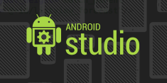
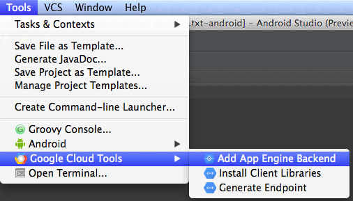

# Android Studio - the integrated tool

Throughout the codelab, we'll use Android Studio, an open-source IDE built for
Android by Google, it is based on IntelliJ IDEA. The IDE comes with coding
assistance tools to help write Java code, and offers an integrated visual editor
with a layout designer and a large number of bundled static code analysis tools
(Lint) to help build quality apps. Finally it's also integrated with **Gradle**
to enable one build across dev environment (IDE, command line, continuous
integration server, etc).

Android Studio is still in preview (version 0.6.x) as of this writing but it is
fully functional and tested for what we're trying to do in this lab. Note we'll
also be using **Java 7** as the target Java SDK for both the Android application
and the App Engine Endpoint backend.

This IDE will also allow you to :

* Create Google App Engine backends right from Android Studio
* Generate Java-specific bindings for use in our Android application
* Benefit from as-you-type validations and quick-fixes when defining the
backend API
* Use App Engine-specific Gradle tooling that allows for a unified
client/backend build

